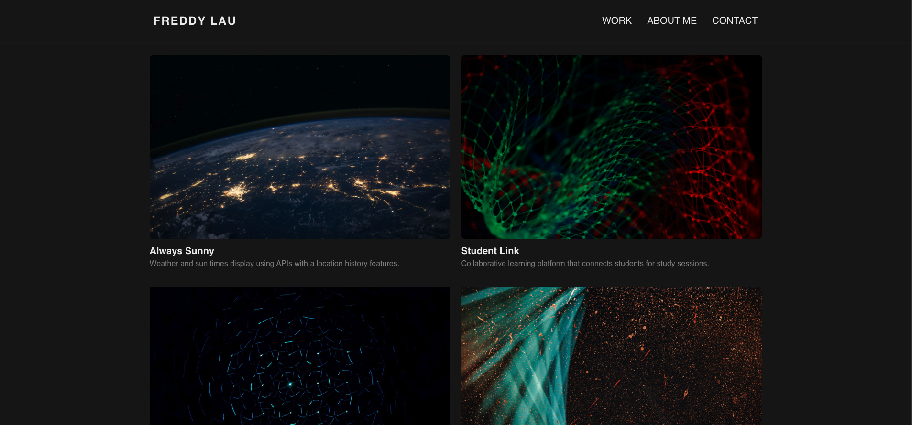

# React Portfolio

## Description

This project showcases my portfolio built with React. It is a single-page website design with a WORK, ABOUT, and CONTACT section.

## Repository

Link to code: [Note Taker Code](https://github.com/freddylau815/react_portfolio)

## Technologies

- Javascript functions
- NPM to load packages
- React for building user interfaces with components
- Netlify for deployment

## Usage

Open link for deployment: [Portfolio]()

## License

## Questions

Github Account: https://github.com/freddylau815 
Email: freddylaudesign@gmail.com
